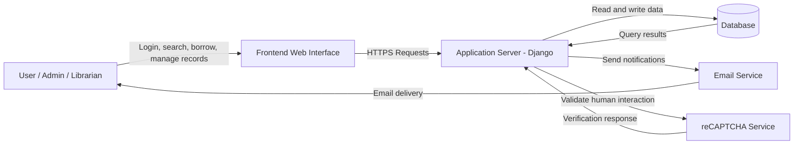

# Security Documentation for Library Management System

## 2. Development Team Information

### 2.1 Group Members

| Name | Role in Project | Responsibilities |
| --- | --- | --- |
| DEE JAY CRISTOBAL | Project Leader | System coordination |
| Member 2 | Backend Developer | Server and database |
| Member 3 | Frontend Developer | UI and client features |
| Member 4 | Security Lead | Security design and testing |

### 2.2 Security Responsibility Assignment

Security responsibility for this project is assigned to **DEE JAY CRISTOBAL**.

| Task | Assigned Member |
| --- | --- |
| Risk Assessment | DEE JAY CRISTOBAL |
| Security Testing | DEE JAY CRISTOBAL |
| Access Control Design | DEE JAY CRISTOBAL |
| Data Protection | DEE JAY CRISTOBAL |

## 3. Introduction

### 3.1 Purpose

This document describes the security measures implemented by the development team to protect the system from potential threats and vulnerabilities. It explains the security responsibilities, main assets, threat assessment, security controls, and incident response procedures used in the Library Management System.

### 3.2 Scope

The scope of this security documentation covers the following parts of the system:

- Web application
- Backend services
- Database security
- User authentication and access control
- Logging and monitoring
- Backup and recovery procedures

## 4. System Overview

### 4.1 System Description

The system is a Django-based Library Management System used to manage library operations such as user accounts, borrowing activities, records, and administrative functions. The system supports staff and user workflows through a web interface and stores application data in a database.

### 4.2 System Architecture

The system is composed of the following components:

- User Interface (Frontend)
- Application Server
- Database
- External Services such as email and reCAPTCHA

#### Data Flow Diagram

### 4.3 Technologies Used

| Component | Technology |
| --- | --- |
| Frontend | HTML, CSS, JavaScript, Django templates, Tailwind-based styling |
| Backend | Python, Django 5.2.7 |
| Database | MySQL, SQLite fallback for local development |
| Frameworks | Django, Crispy Forms, Tailwind integration |

## 5. Asset Identification

The following assets require protection because they are critical to the confidentiality, integrity, and availability of the system.

| Asset | Description | Importance |
| --- | --- | --- |
| User Accounts | User login credentials and account information | High |
| Database | Stores system data and records | High |
| Application Server | Runs system services and business logic | High |
| Source Code | Development code and configuration files | Medium |
| Email Credentials | Used for application notifications | High |
| Backup Files | Copies of data used for recovery | High |

## 6. Threat Identification and Risk Assessment

Potential security threats were identified by reviewing the application architecture, input points, authentication flow, database access, and administrative features. Risks were evaluated using the likelihood of occurrence and the impact on the system if the threat succeeds.

Risk levels were assessed as follows:

- Low: Unlikely and limited impact
- Medium: Possible with moderate impact
- High: Likely or capable of causing major harm

| Threat | Description | Likelihood | Impact | Risk Level |
| --- | --- | --- | --- | --- |
| SQL Injection | Malicious query manipulation | Medium | High | High |
| Unauthorized Access | Illegal login attempts | High | High | High |
| Data Loss | Loss of stored data | Low | High | Medium |
| Cross-Site Scripting | Injection of malicious script into pages | Medium | High | High |
| CSRF Attack | Unauthorized actions sent from another site | Medium | High | High |
| Weak Passwords | Easy-to-guess passwords compromise accounts | Medium | High | High |
| Misconfigured Access Control | Users accessing restricted functions | Medium | High | High |

## 7. Security Controls Implemented

| Security Control | Description |
| --- | --- |
| Input Validation | Prevent malicious or invalid input from reaching the application logic |
| Password Hashing | Protect stored passwords using strong hashing algorithms |
| HTTPS | Secure communication between clients and the application |
| CSRF Protection | Reduce the risk of cross-site request forgery |
| Role-Based Access Control | Restrict sensitive functions to authorized users |
| Secure Configuration | Use environment variables and controlled settings for sensitive values |
| Session Management | Maintain authenticated sessions safely |
| reCAPTCHA | Reduce automated abuse on public forms |

## 8. Access Control

### 8.1 User Roles

| Role | Permissions |
| --- | --- |
| Administrator | Full system access |
| Registered User | Limited system features |
| Guest | View-only access |

### 8.2 Authentication

Users verify their identity through username and password login. The system uses session management after successful authentication. Passwords are stored using secure hashing, and login protection is supported by CSRF safeguards and reCAPTCHA for public-facing forms.

### 8.3 Authorization

Role-Based Access Control (RBAC) is implemented to restrict access to certain system functions. Administrative actions are limited to authorized users only, while standard users can access only permitted features.

## 9. Logging and Security Monitoring

System events are monitored through application logging and operational checks.

| Event | Logging Enabled |
| --- | --- |
| User login | Yes |
| Failed login attempts | Yes |
| Data modification | Yes |
| System errors | Yes |
| Access denied events | Yes |
| Password reset activity | Yes |

## 10. Security Testing

Security testing was performed using OWASP ZAP in Kali Linux through an automated scan of the running web application. The purpose of the scan was to identify common vulnerabilities such as missing security headers, cross-site scripting risks, weak session handling, and other web application issues.

### OWASP ZAP Automated Scan Report

Report status: **To be attached from the OWASP ZAP automated scan output**

Recommended evidence to include in the final submission:

- ZAP quick scan or automated scan summary
- Alerts table with risk and confidence values
- Screenshot or exported HTML/PDF report
- Target URL used during the scan

Example report format:

| Alert | Risk | Confidence | Description |
| --- | --- | --- | --- |
| Missing Security Header | Medium | Medium | Security header not set on some responses |
| Cookie Without HttpOnly Flag | Medium | Medium | Session cookie may be exposed to client-side scripts |
| X-Content-Type-Options Header Missing | Low | Medium | Browser MIME sniffing protection is incomplete |
| Cross-Site Scripting | High | Medium | Input may allow script injection if not sanitized |

## 11. Incident Response Plan

The system and team will respond to a security incident using the following steps:

1. Identify suspicious activity
2. Log the incident
3. Notify the project administrator
4. Investigate the issue
5. Apply corrective measures
6. Verify that the issue has been contained
7. Review logs and update controls if necessary

## 12. Backup and Recovery Plan

The system prevents data loss through the following measures:

- Regular database backups
- Secure backup storage
- Recovery procedures for restoring data after corruption or failure
- Separation of backup copies from the main production data
- Periodic verification that backups can be restored successfully

## 13. Security Limitations (BE HONEST)

The current security implementation has the following limitations:

- No multi-factor authentication
- Limited penetration testing
- Security testing conducted mainly during development
- Dependence on correct server configuration for full HTTPS enforcement
- External security services such as reCAPTCHA and email delivery depend on third-party availability
- Automated vulnerability scanning report still needs to be attached from the actual OWASP ZAP run

## Conclusion

The Library Management System includes security controls for authentication, access control, transport security, input validation, logging, and backup planning. The system is reasonably protected for development and academic use, but further hardening, repeated testing, and production security review are still required before deployment.
