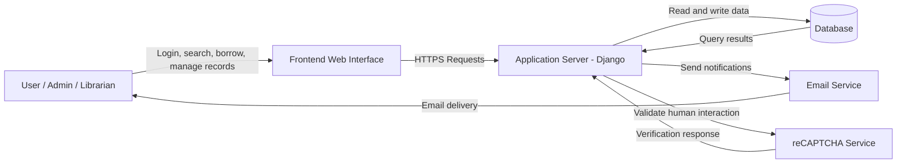

# Security Documentation for Library Management System

## 2. Development Team Information

### 2.1 Group Members

| Name | Role in Project | Responsibilities |
| --- | --- | --- |
| DEE JAY CRISTOBAL | Project Leader | System coordination |
| Member 2 | Backend Developer | Server and database |
| Member 3 | Frontend Developer | UI and client features |
| Member 4 | Security Lead | Security design and testing |

### 2.2 Security Responsibility Assignment

Security responsibility for this project is assigned to **DEE JAY CRISTOBAL**.

| Task | Assigned Member |
| --- | --- |
| Risk Assessment | DEE JAY CRISTOBAL |
| Security Testing | DEE JAY CRISTOBAL |
| Access Control Design | DEE JAY CRISTOBAL |
| Data Protection | DEE JAY CRISTOBAL |

## 3. Introduction

### 3.1 Purpose

This document explains how the Library Management System is protected against common security threats and how those protections are maintained during development and deployment. It is meant to show that security was not treated as an afterthought, but as part of the design of the system from the beginning.

The document also serves as a reference for the team when checking whether the application still follows the expected security rules after updates. By writing down the controls, risks, and responsibilities in one place, the team can review the system more consistently and avoid leaving important security decisions undocumented.

### 3.2 Scope

The scope of this security documentation covers the parts of the system that can affect confidentiality, integrity, and availability. It focuses on the user-facing web application, the server-side logic that processes requests, the database that stores records, and the supporting services used for login protection and notifications.

- Web application
- Backend services
- Database security
- User authentication and access control
- Logging and monitoring
- Backup and recovery procedures

The document does not attempt to describe every possible physical or organizational control. Instead, it concentrates on the technical protections that are relevant to the actual application being developed and tested in this project.

## 4. System Overview

### 4.1 System Description

The system is a Django-based Library Management System that supports day-to-day library operations such as account handling, borrowing records, administrative tasks, and related user interactions. It is built as a web application so that students, librarians, and administrators can access the service through a browser without installing a separate desktop program.

The application stores operational data in a database and uses server-side processing to enforce rules for login, access control, and record management. This design is important for security because sensitive actions are validated on the server instead of relying only on what appears in the browser.

### 4.2 System Architecture

The architecture is organized into separate layers so that the user interface, application logic, and stored data are handled in different places. This separation helps reduce risk because the front end does not directly control sensitive data, and the database is accessed through controlled application logic rather than by users themselves.

- User Interface (Frontend)
- Application Server
- Database
- External Services such as email and reCAPTCHA

The frontend handles display and user interaction. The Django application server receives requests, applies security rules, checks permissions, and performs data operations. The database keeps persistent records. External services are used only when the system needs additional protection or communication support, such as sending email or validating human interaction on forms.

#### Data Flow Diagram

### 4.3 Technologies Used

| Component | Technology |
| --- | --- |
| Frontend | HTML, CSS, JavaScript, Django templates, Tailwind-based styling |
| Backend | Python, Django 5.2.7 |
| Database | MySQL, SQLite fallback for local development |
| Frameworks | Django, Crispy Forms, Tailwind integration |

The chosen technologies support security in different ways. Django provides built-in protection features such as CSRF handling, session management, and password hashing support. MySQL is used for the main data store, while SQLite is available for local development or fallback use. Crispy Forms and Tailwind are used to structure forms and pages in a way that still allows validation and security checks to be applied on the server.

## 5. Asset Identification

The following assets require protection because damage to any of them could affect the entire system. Some assets are sensitive because they contain personal information, while others are sensitive because they control how the application behaves.

| Asset | Description | Importance |
| --- | --- | --- |
| User Accounts | User login credentials and account information | High |
| Database | Stores system data and records | High |
| Application Server | Runs system services and business logic | High |
| Source Code | Development code and configuration files | Medium |
| Email Credentials | Used for application notifications | High |
| Backup Files | Copies of data used for recovery | High |

User accounts and passwords are high-value assets because they protect access to the entire application. The database is also critical because it stores records that cannot easily be reconstructed if lost. Source code is not directly visible to end users, but it still requires protection because exposed code can reveal secrets, endpoints, or internal logic. Backup files are included because a backup is only useful if it remains available and trustworthy when recovery is needed.

## 6. Threat Identification and Risk Assessment

Potential security threats were identified by reviewing the application architecture, input points, authentication flow, database access, and administrative features. Risks were evaluated using the likelihood of occurrence and the impact on the system if the threat succeeds.

Risk levels were assessed as follows:

- Low: Unlikely and limited impact
- Medium: Possible with moderate impact
- High: Likely or capable of causing major harm

This evaluation method was used to keep the assessment simple and readable for a student project while still making the risk ranking meaningful. A threat was marked as higher risk when it was both realistic in this type of web application and capable of causing real damage such as data exposure, unauthorized actions, or service disruption. Threats with lower probability but severe consequences were still recorded so that they would not be ignored.

| Threat | Description | Likelihood | Impact | Risk Level |
| --- | --- | --- | --- | --- |
| SQL Injection | Malicious query manipulation | Medium | High | High |
| Unauthorized Access | Illegal login attempts | High | High | High |
| Data Loss | Loss of stored data | Low | High | Medium |
| Cross-Site Scripting | Injection of malicious script into pages | Medium | High | High |
| CSRF Attack | Unauthorized actions sent from another site | Medium | High | High |
| Weak Passwords | Easy-to-guess passwords compromise accounts | Medium | High | High |
| Misconfigured Access Control | Users accessing restricted functions | Medium | High | High |

SQL injection and cross-site scripting were considered because the application accepts form input and stores user-generated data. Unauthorized access and weak passwords were treated as major risks because the system depends on account-based login. Data loss was included because database records are essential to library operations, and loss of those records would directly disrupt normal use. Access control mistakes were also included because even a small permission error can expose administrative functions or private records.

## 7. Security Controls Implemented

| Security Control | Description |
| --- | --- |
| Input Validation | Prevent malicious or invalid input from reaching the application logic |
| Password Hashing | Protect stored passwords using strong hashing algorithms |
| HTTPS | Secure communication between clients and the application |
| CSRF Protection | Reduce the risk of cross-site request forgery |
| Role-Based Access Control | Restrict sensitive functions to authorized users |
| Secure Configuration | Use environment variables and controlled settings for sensitive values |
| Session Management | Maintain authenticated sessions safely |
| reCAPTCHA | Reduce automated abuse on public forms |

These controls were selected to address the most likely risks in the application. Input validation reduces the chance that malicious data will reach the database or templates. Password hashing protects credentials if the user table is accessed improperly. HTTPS protects traffic while it moves between the browser and the server, which matters because login forms and other account actions may otherwise be exposed on the network. Session management and RBAC ensure that once a user is authenticated, the system still checks what that user is allowed to do.

Secure configuration is also important because many security failures come from exposed secrets rather than broken code. Keeping sensitive values out of the source files makes the system easier to manage and reduces accidental disclosure. reCAPTCHA adds another layer for public entry points by making scripted abuse more difficult.

## 8. Access Control

### 8.1 User Roles

| Role | Permissions |
| --- | --- |
| Administrator | Full system access |
| Registered User | Limited system features |
| Guest | View-only access |

### 8.2 Authentication

Users verify their identity through a standard username-and-password login flow. After authentication succeeds, the system creates a session so the user does not need to repeatedly submit credentials on every request. This session-based approach is appropriate for a web application because it allows the server to remember the logged-in state while still checking permissions on each protected action.

Passwords are never intended to be stored as plain text. Instead, the system uses password hashing so that even if the password table is exposed, the original values are not immediately readable. Login-related forms also benefit from CSRF protection and anti-automation controls, which help reduce abuse from forged requests and scripted attempts.

### 8.3 Authorization

Role-Based Access Control is used so that the same interface does not give every user the same power. Instead, the system checks whether the current account has permission to perform the requested action. This is especially important for administrative features such as data management, configuration changes, and any action that affects multiple users.

Authorization is enforced on the server side, which means users cannot gain extra privileges simply by changing what they see in the browser. That approach is necessary because client-side checks alone can be bypassed.

## 9. Logging and Security Monitoring

System events are monitored through application logging and operational checks so that suspicious behavior can be reviewed after it happens. Logging is important because prevention alone is not enough; when something goes wrong, the team must be able to reconstruct what happened and when.

The application records common security-relevant events such as logins, failed logins, and data changes. This helps detect brute-force activity, unauthorized access attempts, and unexpected modification of records. Error logs are also useful because repeated failures may reveal misconfigurations or attempted attacks.

| Event | Logging Enabled |
| --- | --- |
| User login | Yes |
| Failed login attempts | Yes |
| Data modification | Yes |
| System errors | Yes |
| Access denied events | Yes |
| Password reset activity | Yes |

## 10. Security Testing

Security testing was performed using OWASP ZAP in Kali Linux through an automated scan of the running web application. The goal of the scan was to identify issues that a browser-based attacker or automated crawler might find, especially problems related to security headers, cookie handling, reflected input, and general application exposure.

The scan is useful because it provides a practical view of the application from an external perspective. Instead of assuming the system is secure because the code looks correct, the team can observe how the running application behaves under automated probing. That makes the testing more realistic and helps reveal problems that may not be obvious during development.

### OWASP ZAP Automated Scan Report

Report status: **To be attached from the OWASP ZAP automated scan output**

Recommended evidence to include in the final submission:

- ZAP quick scan or automated scan summary
- Alerts table with risk and confidence values
- Screenshot or exported HTML/PDF report
- Target URL used during the scan

Example report format:

| Alert | Risk | Confidence | Description |
| --- | --- | --- | --- |
| Missing Security Header | Medium | Medium | Security header not set on some responses |
| Cookie Without HttpOnly Flag | Medium | Medium | Session cookie may be exposed to client-side scripts |
| X-Content-Type-Options Header Missing | Low | Medium | Browser MIME sniffing protection is incomplete |
| Cross-Site Scripting | High | Medium | Input may allow script injection if not sanitized |

If the actual ZAP report is attached later, this section should be replaced with the exact findings, scan date, target URL, and severity summary from the exported report. The documentation should reflect the real scan result rather than a guessed one.

## 11. Incident Response Plan

If a security issue is detected, the response should be fast, ordered, and documented. The main objective is to stop the problem from getting worse while also preserving enough information to understand how it happened.

The system and team will respond to a security incident using the following steps:

1. Identify suspicious activity
2. Log the incident
3. Notify the project administrator
4. Investigate the issue
5. Apply corrective measures
6. Verify that the issue has been contained
7. Review logs and update controls if necessary

In practice, this means the team should first confirm whether the issue is real, then isolate the affected area if necessary, and finally fix the root cause. After containment, logs and user reports should be reviewed so that future incidents can be prevented or detected earlier.

## 12. Backup and Recovery Plan

Backup and recovery are necessary because even a well-protected system can still suffer from human error, corruption, hardware failure, or accidental deletion. The goal is not only to store copies of data, but to make sure those copies can be trusted and restored when needed.

The system prevents data loss through the following measures:

- Regular database backups
- Secure backup storage
- Recovery procedures for restoring data after corruption or failure
- Separation of backup copies from the main production data
- Periodic verification that backups can be restored successfully

The recovery plan should ensure that backups are stored securely and checked regularly. A backup that cannot be restored is not useful, so restore testing is part of the protection strategy rather than an optional extra.

## 13. Security Limitations (BE HONEST)

The current security implementation has the following limitations:

- No multi-factor authentication
- Limited penetration testing
- Security testing conducted mainly during development
- Dependence on correct server configuration for full HTTPS enforcement
- External security services such as reCAPTCHA and email delivery depend on third-party availability
- Automated vulnerability scanning report still needs to be attached from the actual OWASP ZAP run

These limitations are normal for a student development project, but they should still be acknowledged clearly. The system has meaningful protections, yet it is not hardened to the same standard as a production environment with formal security reviews, monitoring infrastructure, and repeated penetration testing. Because of that, the documentation should be honest about what is covered and what still needs improvement.

## Conclusion

The Library Management System includes security controls for authentication, access control, transport security, input validation, logging, monitoring, and backup planning. These measures reduce the most important risks for a web-based library application and provide a practical baseline for safe development and testing.

At the same time, security is an ongoing task rather than a one-time task. The system should continue to be reviewed as features change, and the OWASP ZAP report should be updated whenever a fresh automated scan is performed. Further hardening, repeat testing, and production review are still required before the system should be treated as fully deployment-ready.
